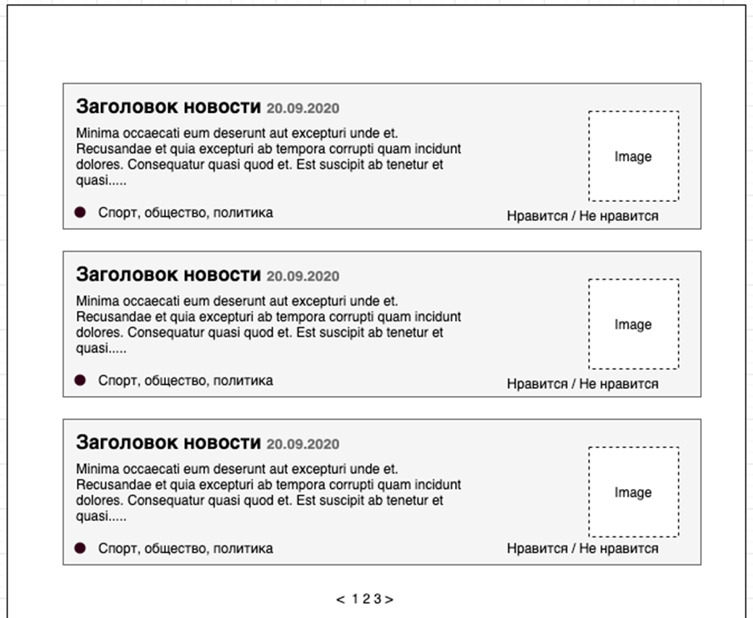

Junior laravel developer

	Написать страницу с лентой новостей, где отображается превью текст, картинка, заголовок, теги.
	Пример отображения (дизайн не важен, front может быть любой и не учитывается при проверки реализации):

У новостей должна быть возможность выставлять лайки и дизлайки
Сортировка новостей в списке должна быть по следующему правилу:
1.	Сортировка идет по рейтингу. формула расчета рейтинга: количество лайков - количество дизлайков (Пример: лайков 5 дизлайков 1 . 5 - 1 = 4 - рейтинг статьи). Направление сортировки по убыванию
2.	Если рейтинг одинаковый сортировать по дате добавления.

Общие требования к выполнению задачи:
1.	Теги должны быть реализованы через связь много ко многим
2.	Лайки и дизлайки должны хранится в отдельной таблице (1 голос - одна запись)
3.	Новости нужно брать с RSS источника https://lenta.ru/rss/news и запускать парсинг при помощи команды из консоли. Обязательно отслеживать те записи которые уже были добавлены на сайт(если новость есть на сайте, то пропускаем и не обрабатываем ее). В консоле после выполнения выводим фразу “На сайт было добавлено {{количество}} новостей”
4.	Картинку сохранять файлом, а не ссылкой в базу.
5.	Обязательно учесть постраничную навигацию (Сортировка должна корректно работать с учетом разбиения вывода новостей по страницам)
6.	Таблицы создавать через миграции

Оценка реализации: 3,5 - 4 ч. (Отсчет с момента отправки HR)
